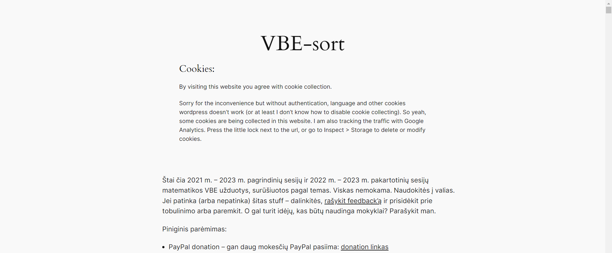
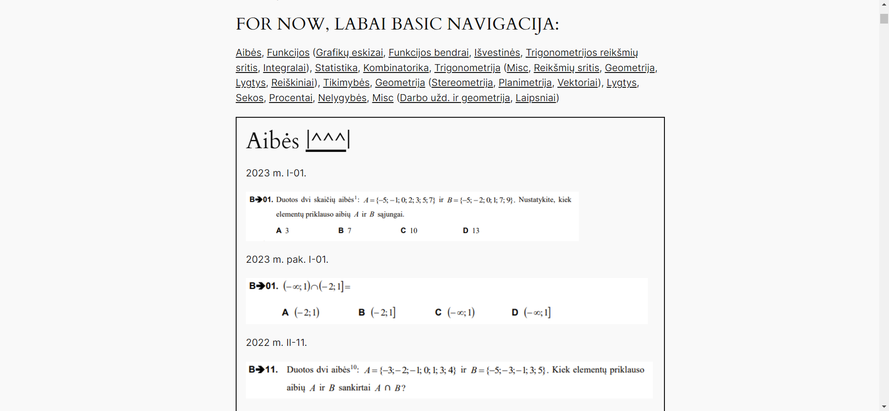

# VBE-sort
Website with Lithuania state exam (high school graduation) math problems, sorted in categories.

This branch with wordpress is not in use anymore. I migrated to ReactJS (check main branch), cuz I feel more comfortable with it and can do more at the time, later probably gonna migrate to nextjs with payloadCMS.

New version of website deployed here with SSL: [https://vbesort.lt](https://vbesort.lt)

Use, share, rate, suggest, contribute, support.

## Old screenshots



### Tech
- Wordpress image
- mysql
- nginx
- Let's encrypt (with certbot)
- Hostinger domain
- AWS EC2
- Google Analytics
- VSCode with Remote-SSH extension by MS

## Deployment process I ran (adjust to your needs)

1. Create AWS EC2 instance ubuntu at least t2.small (t2.micro is too small) with at least 2GB storage, in new security group rules enable access via http, https and ssh from custom IP (my home network), generate .pem ssh key.
2. Configure VSCODE so you can access the server from it. Install Remote - SSH extension by Microsoft (idk which one has the main functionality, I have 3: "Remote - SSH", "Remote - SSH: Editing Configuration Files", "Remote Explorer"). Configure your .ssh/config file (bottom left blue box > Connect to Host > Configure ssh hosts > ......./.ssh/config) like this:
```
Host MyHomeServer
  HostName some.public.ip.of.your.home.network
  User home-or-root-or-other

Host AWS-server-proxy
  IdentityFile /local/path/to/your/ssh/key/ssh-key.pem
  HostName some.public.aws.server.ip
  User ubuntu
  ProxyJump MyHomeServer

Host AWS-server-home
  IdentityFile /local/path/to/your/ssh/key/ssh-key.pem
  HostName some.public.aws.server.ip
  User ubuntu
```
Now you can connect to AWS server from home via "" host, and from anywhere else (as long as you have a turned on computer at home with ssh configuration (port 22 is forwarded and the computer has an opened ssh connection)) via "" host. Same bottom blue box, and then your AWS-server-proxy or AWS-server-home and you are in your AWS server.
3. Install docker and docker compose
```
sudo apt-get update
sudo apt-get install apt-transport-https ca-certificates curl software-properties-common
curl -fsSL https://download.docker.com/linux/ubuntu/gpg | sudo apt-key add -
sudo add-apt-repository "deb [arch=amd64] https://download.docker.com/linux/ubuntu $(lsb_release -cs) stable"
sudo apt-get update
sudo apt-get install docker-ce
sudo curl -L "https://github.com/docker/compose/releases/download/1.29.2/docker-compose-$(uname -s)-$(uname -m)" -o /usr/local/bin/docker-compose
sudo chmod +x /usr/local/bin/docker-compose
sudo usermod -aG docker ubuntu
newgrp docker 
sudo systemctl start docker
sudo systemctl enable docker
sudo chmod 666 /var/run/docker.sock
```
4. git clone this repo. Or just copy/move nginx/ and docker-compose.yaml
5. If you migrate volumes from somewhere (if you want the old version of data from me, email me [naglis.suliokas@gmail.com](mailto:naglis.suliokas@gmail.comn), if I haven't accidently deleted them :D), make sure they are accessible by wordpress and mysql. I just got annoyed and let all users access it :D with this command:
```
chmod -R a+rwx volume_directory_name
```
If you do all of this from scratch, docker-compose will create volume for you. You just might need to create an empty volume directory for it.
6. Add gitignored files and directories:
  - ./letsencrypt directory with generated ssl certificates and keys (mine was generated using certbot for vbesort.lt)
  - .env file with your env variables:
```
DB_USER=usernamecanbesecure
DB_PASSWORD=yourpassword
DB_NAME=yourdbname
DB_ROOT_PASSWORD=yourpasswordverysecure
WP_VOLUME_PATH=/path/to/volume/wp_data/which/has/_data/dir
DB_VOLUME_PATH=/path/to/volume/db_data/which/has/_data/dir
```
7. run docker compose up, as you open port 80, you will be asked to register for wordpress and similar. So do all of that. 
8. As for me I then just edited twentytwentyfour theme with my content and that is it. 
9. I also added google analytics script tag in _data/wp-content/themes/twentytwentyfour/functions.php file (cuz there was no html file with head tag) like this:
```
add_action( 'init', 'twentytwentyfour_pattern_categories' );

function add_google_analytics() { ?>
	<!-- Google tag (gtag.js) -->
<script async src="https://www.googletagmanager.com/gtag/js?id=${YOUR_UNIQUE_GOOGLE_PROVIDED_URL}"></script>
<script>
  window.dataLayer = window.dataLayer || [];
  function gtag(){dataLayer.push(arguments);}
  gtag('js', new Date());

  gtag('config', '${ANOTHER_UNIQUE_ID}');
</script>
	<?php }
add_action('wp_head', 'add_google_analytics');
```
10. For database volume backup I used scp command:
```
sudo scp -r /your/path/to/volumes user@your.backup.server.ip:/path/to/backup/dir
```
11. If you change something, like db password, or similar, then good luck justifying yourself to chatgpt :D You're gonna gave a lot of pain. Which I don't remember all, but I know, that as you change env variables in dockercompose (.env file is used), you gonna need to change the same variables in wp_config.php file (in wp_data volume).
12. Also, make sure you adjust all the IPs and container names in nginx config file. And maybe somewhere else, where I forgot. If I really did forgot something, then good luck reading error logs :D. If someone actually is reading this and trying to run things the way I've written here, you can email me, I'd be happy to help.