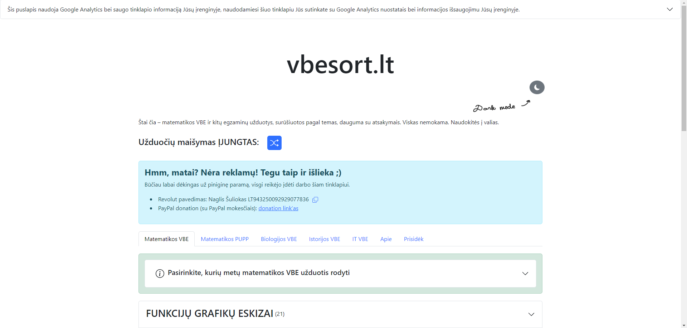
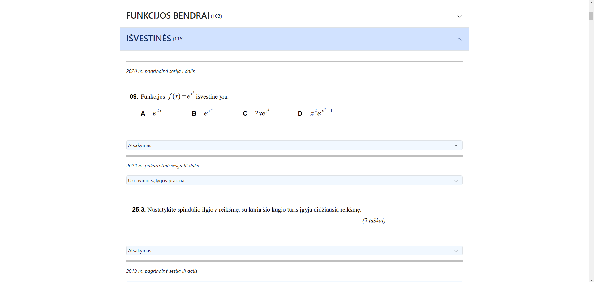
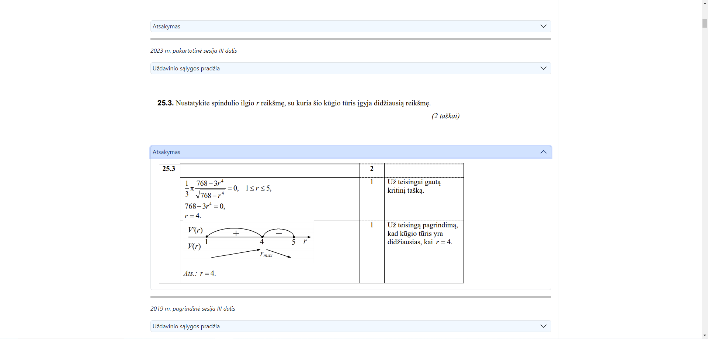
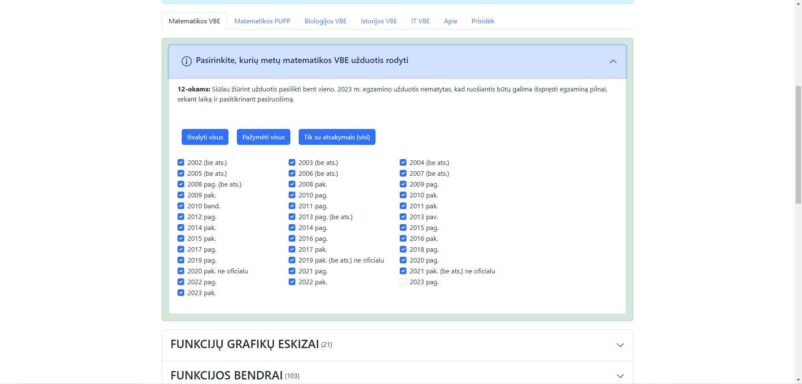

# vbesort.lt

Website with Lithuania state exam (_liet. VBE_) math and other exams' problems, sorted by topic.

Website is deployed here: [https://www.vbesort.lt](https://www.vbesort.lt)

Screenshot content here: [Google drive](https://drive.google.com/drive/folders/1hVOXXNupm-cZZdraDrXthxK3PUeCeY7g?usp=sharing)

The whole website is in Lithuanian (because it is made for Lithuania's students and teachers), all the exam problems are also in Lithuanian.

Used by 2k active monthly users!

## Screenshots






## Tech

- React with Typescript
- [React Bootstrap Components](https://react-bootstrap.github.io/)
- [React Bootstrap Icons](https://icons.getbootstrap.com/)
- Firebase Hosting

## Setup for dev

1. Download all the problem screenshots from [this Google Drive](https://drive.google.com/drive/folders/1hVOXXNupm-cZZdraDrXthxK3PUeCeY7g?usp=sharing) and place all the folders under [public/](public/) directory.

2. Install if not have yet `nodejs` and `npm`

3. Run locally (access via browser [http://localhost:5173](http://localhost:5173))

```bash
npm install
npm run dev
```

4. For deployment run if not have yet `npx firebase login`, setup stuff on firebase hosting and change project name in [/.firebaserc](/.firebaserc) to the name you use in firebase hosting.

```bash
npm run build
npm run deploy
```

You might not succeed from the first time (cuz of many image files) but after a few deploy tries everything should upload. It doesn't reach storage limits, it just reaches timeout (after a few deploy tries everything will be uploaded by parts).

> There was in previous versions some cool stuff with docker, AWS, Wordpress etc. You can chack it out and have a nice read here: [v1.0.0](https://github.com/naglissul/vbe-sort/tree/v1.0.0).

## Working principle

All data is kept on the client side. No API or database. Meta data is in JSONs in `data/` directories in every page, e.g. [here](/src/MainPage/data/). Then according to the meta data in JSONs problem and answer screenshots are taken from `public/` directory (it is gitignored, you need to download it from Google Drive, checkout 'Setup for dev' section).

Mainly the data about problems is kept in their screenshot filenames. There's a lot of explaining for the naming logic, so for that checkout the next section.

## File naming

(For now mainly described in the CONTRIBUTE.md file, later gonna be here also)

## Automatisation

See more in github.com/skafis-edtech/autom

## Contribute

Contribution instructions are described in Lithuanian [here](./CONTRIBUTE.md).

## For the future

Links to sci-dict.org

NMPP Math problems, olympiad problems, school acceptance problems, hist VBE problems, lt VBE essay topics.

AI problem generator
