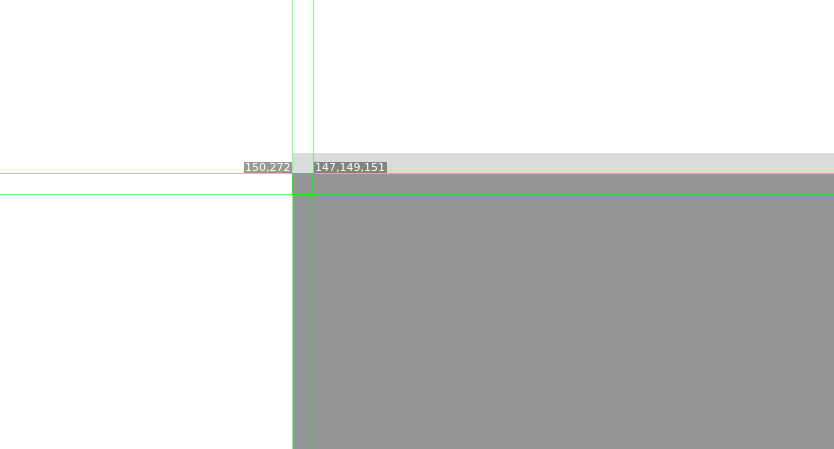
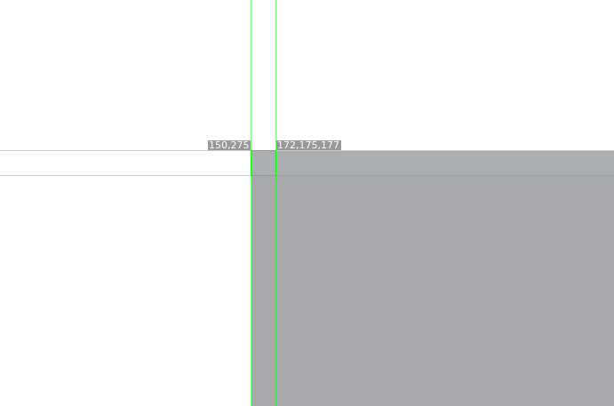

# Screenshot generation from PDFs

gen_questions.py generates problem question screenshots.

## Set up

### Libraries

Python libraries:

- PIL - "pip install pillow"
- pdf2image - "pip install pdf2image"
- PyPDF2 - "pip install PyPDF2"
- codecs - built-in

Also download and extract Release-24.02.0-0.zip from https://github.com/oschwartz10612/poppler-windows/releases/, folder mamed "poppler-24.02.0" put into current dir.

### Folders

Create these folders:

"final" (empty)
"page_images" (empty)
"atsakymai"
"egzaminai" (put PDFs here)

Put problem set PDFs into egzaminai/ folder named: "metai-1.pdf" jei pagrindinės sesijos egzaminas arba "metai-2.pdf" jei pakartotinės. Atsakymų failai turi vadintis taip pat, tik kad su "a" gale. pvz užd. failas "2023-1.pdf" ir jo ats. "2023-1a.pdf"

## Usage

Tiesiog reikia paleisti "gen_questions.py" ir jis sugeneruos klausimus į final folderį.

### Notes

Labai rekomenduoju greitai peržiūrėti rezultatą, jei klausimas yra per du puslapius jis nesuveikia, ir šiap kartais būna random klaidų

### NMPP 8
pix inspection:

